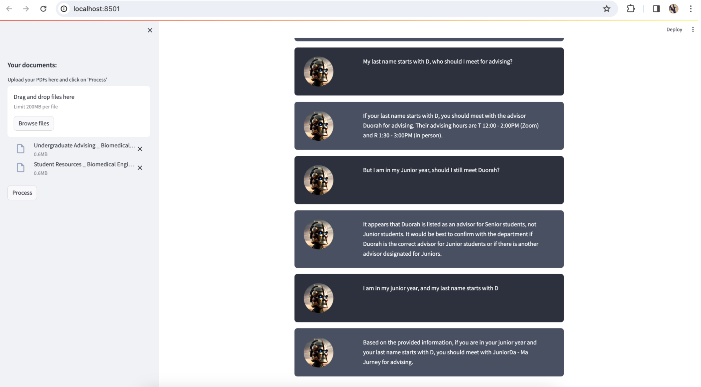

# Conversational PDF Chat Application with LangChain
This repository contains the code for a conversational AI application developed using LangChain. The application allows users to interact with a chatbot, ask questions, and receive relevant responses based on processed text documents. 

## Overview
The conversational AI application utilizes LangChain, a Python library for natural language processing tasks such as text splitting, vectorization, and memory management. The application integrates with language models from both OpenAI and Hugging Face for generating embeddings and responding to user queries.

## Setup
To set up the application locally, follow these steps:

1. Clone the repository to your local machine.
2. Install the required dependencies using pip install -r requirements.txt.
3. Obtain API keys for OpenAI (if using) and configure them in the `.env` file.
4. Ensure that Streamlit is installed (pip install streamlit).
5. Run the application using Streamlit: streamlit run app.py.

## Usage
Once the application is running, users can interact with the chatbot through the provided user interface. They can upload text documents, ask questions, and receive responses in real-time. 

## Parts Overview
The application development is divided into several parts, each covering different aspects:

- Text Processing: Preprocessing text documents for further analysis.
- Vectorization: Generating embeddings from text using OpenAI or Hugging Face models.
- Memory Management: Implementing memory for context-aware responses.
- User Interface: Creating a user-friendly interface using Streamlit.
- Handling User Inputs: Processing user queries and generating responses.
- Displaying Chat Messages: Rendering chat messages using HTML templates.
- Integrating OpenAI Models: Incorporating OpenAI models for embedding generation.
- Integrating Hugging Face Models: Utilizing Hugging Face models as an alternative to OpenAI.
- Conversation Chain Creation: Creating a conversational chain for managing chat interactions.
- Memory Persistence: Ensuring persistence of chat history and session state.
- Final Application Integration: Integrating all components into a cohesive application.

## Screenshots

